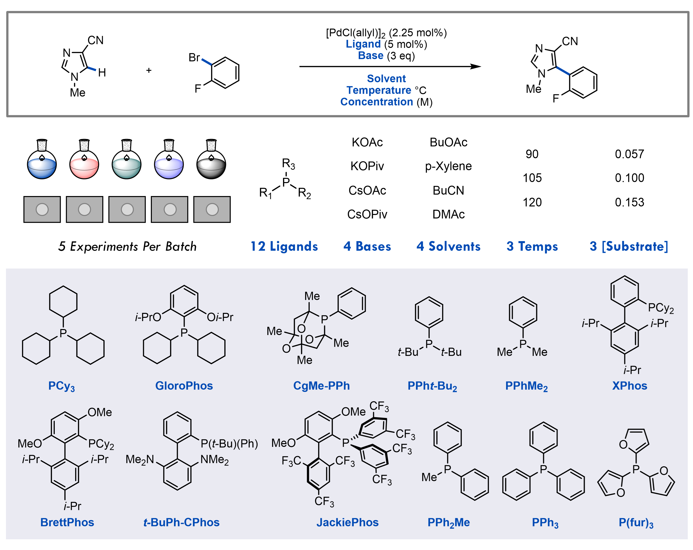

# EvML

## Expert versus Machine Learning

Benchmarking expert decisions versus machine learning methods

  

## Reaction optimization game

The aim of the reaction optimization game is to probe the decisions made by automated machine learning systems and chemists of different backgrounds and levels of experience (e.g. process chemists, med chemists, graduate students, chemistry faculty). In the game, chemists are armed with only their personal knowledge and data they gain by running experiments. By comparison the machine learning alorithms have no knowledge prior to running experiments. ***While the game is intended to simulate reaction optimization on a fixed experimental budget, the data is real.*** Each experiment you "run" will return the result of the corresponding experiment in the lab! Before playing please carefully read the rules below.

## Rules

Your boss has tasked you with preparing 5-(2-fluorophenyl)-1-methyl-1H-imidazole-4-carbonitrile and you have identified palladium-catalyzed direct arylation as a promissing strategy. Your objective is to optimize the yield of this reaction by varying the following parameters: base, ligand, solvent, concentration, and temperature. The reaction scheme and identity of each component are summarized above. Your bench has room to run 5 experiments per "day". Each round you must select which experiments to run in the **Run Experiments** tab. After specifying the components and conditions for each reaction you can "run" the experiments by hitting the **Run experiments** button. The results will then be added to a summary table under the **Experiment Results** tab. Your boss is giving you "1 month" to find optimal conditions and you can run 1 batch of 5 experiments "per weekday" (graduate students you are allowed to take the weekend off). This means you will have up to 20 batches of reactions for a total of 100 experiments to find the best experimental conditions (around 6% of the experimental space). ***Please make sure to complete all the trials (5 experiments per submission and up to 100 experiments) in a single sessions on the web page!!!*** The app will finalize your results if you leave the page. You can submit your responses as quickly as you want. If you believe that you have optimized the reaction, you may stop the trials early. **Play fairly**. You can use only your personal knowledge about the reaction and the information you gain from each of the screens to make your decisions. No use of online resources, books, etc. No crowd sourcing. No sharing of "experimental" results between those participating. Finally, **this is a statistical study** so please do not play the game more than once. If you would like to try again after your official play through, use the same user name and append **rerun** so that it can be excluded from the analysis.

    

[1] This game was developed by Benjamin Shields of Princeton and Jun Li, Jay Stevens, and Jake Janey of Bristol Myers Squibb.
